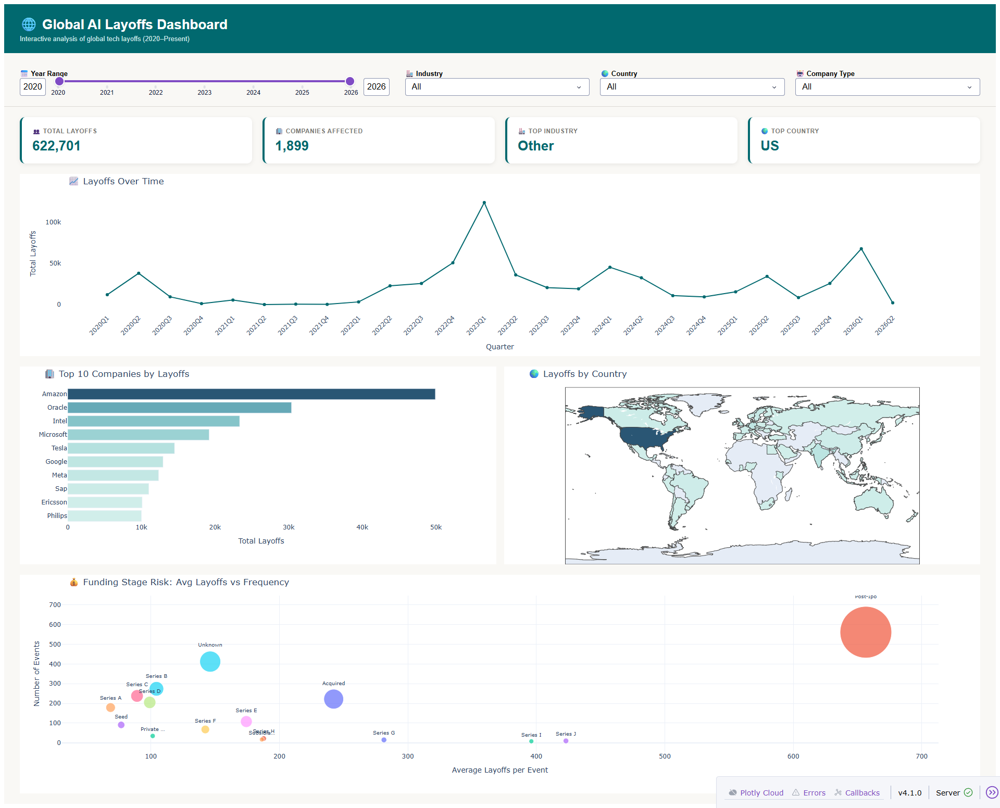
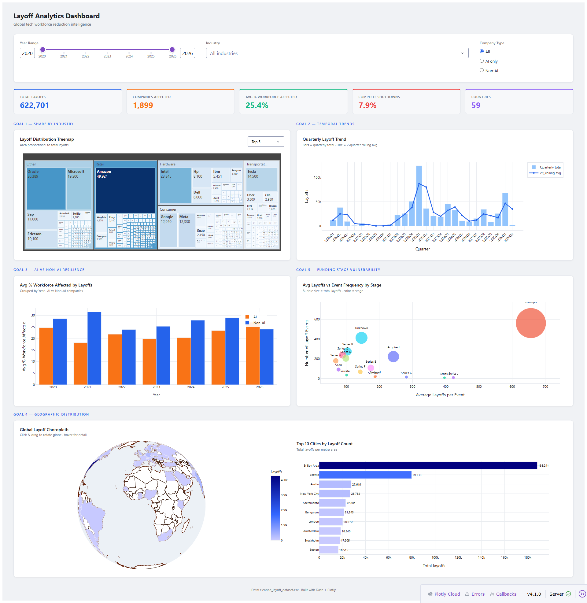

# 🌐 Global AI Layoffs & Job Market Analysis (2020–Present)


> End-to-end data analysis project exploring global AI and tech industry layoffs from 2020 to present — including data cleaning, exploratory analysis, and two fully interactive Dash dashboards.

---

## 📊 Dashboard Previews

### Version 1 — Clean Analytics Dashboard


### Version 2 — Advanced Analytics Dashboard


---

## 📁 Project Structure
global-ai-layoffs/
├── data/
│ ├── layoffs_events.csv ← Raw Kaggle dataset
│ └── global_ai_layoffs_cleaned.csv ← Cleaned & processed
├── notebooks/
│ ├── 01_data_cleaning.ipynb ← Data wrangling & preprocessing
│ ├── 02_data_visualization.ipynb ← EDA & static charts
│ ├── 03_dashboard.ipynb ← Interactive Dash dashboard v1
│ └── 04_dashboard_v2.ipynb ← Interactive Dash dashboard v2
├── assets/
│ ├── dashboard_v1.png
│ └── dashboard_v2.png
├── .gitignore
├── requirements.txt
└── README.md

---

## 🎯 Business Goals

| # | Goal | KPIs |
|---|------|------|
| 1 | Which industries were most affected? | Total layoffs by industry, avg layoffs per company |
| 2 | How did layoffs trend over time? | Quarterly trends, year-over-year changes |
| 3 | Are AI companies more resilient? | Avg % workforce laid off (AI vs Non-AI) |
| 4 | Which cities & countries had the highest reductions? | Total layoffs by country, top 10 cities |
| 5 | Which funding stages are most vulnerable? | Avg layoffs by stage, layoff event frequency |

---

## 📓 Notebooks

### `01_data_cleaning.ipynb`
- Handles missing values with industry/stage median imputation
- Fixes data types (`pct_workforce`, `raised_mm`, `date`)
- Standardizes text fields and categorical columns
- Engineers date features (`year`, `month`, `quarter`, `year_quarter`)
- Exports cleaned dataset ready for analysis

### `02_data_visualization.ipynb`
- 8 interactive Plotly charts covering all 5 business goals
- Layoff trends over time, top industries & companies
- Global choropleth map, AI vs Non-AI resilience comparison
- Funding stage bubble chart showing risk vs frequency

### `03_dashboard.ipynb` — Dashboard V1
- Year range slider, industry, country & company type filters
- 4 live KPI cards (total layoffs, companies, top industry, top country)
- Line chart, top companies bar chart, world map, bubble chart

### `04_dashboard_v2.ipynb` — Dashboard V2
- Advanced layout with drill-down treemap by industry → company
- Quarterly trend with 2-quarter rolling average overlay
- AI vs Non-AI grouped bar chart by year
- Rotatable orthographic globe choropleth
- Top 10 cities bar chart

---

## 🔍 Key Findings

| Insight | Finding |
|---------|---------|
| Worst year | 2023 — driven by post-pandemic over-hiring correction |
| Peak quarter | Q1 2023 — highest single quarter in tech layoff history |
| Most affected industry | Consumer & Retail |
| Highest layoff country | United States |
| Most vulnerable stage | Post-IPO companies had the highest total layoffs |
| AI vs Non-AI resilience | Non-AI companies showed slightly higher avg % workforce reductions |

---

## 🚀 How to Run

**1. Clone the repository**

```bash
git clone https://github.com/amgadyassin/global-ai-layoffs.git
cd global-ai-layoffs
```

**2. Install dependencies**

```bash
pip install -r requirements.txt
```

**3. Download the dataset via Kaggle API**

```bash
kaggle datasets download -d belbino/global-ai-layoffs-and-job-market-2020-present --unzip -p data/
```

> The dataset will be saved as `layoffs_events.csv` inside the `data/` folder.

**4. Run the notebooks in order**

| Notebook | Output |
|---|---|
| `01_data_cleaning.ipynb` | Generates `global_ai_layoffs_cleaned.csv` |
| `02_data_visualization.ipynb` | Static EDA charts |
| `03_dashboard.ipynb` | Dashboard at http://127.0.0.1:8050 |
| `04_dashboard_v2.ipynb` | Dashboard at http://127.0.0.1:8051 |

---

## 🛠️ Tech Stack

| Tool | Purpose |
|------|---------|
| Python 3.10+ | Core language |
| Pandas | Data manipulation & cleaning |
| NumPy | Numerical operations |
| Plotly Express | Interactive visualizations |
| Dash | Web dashboard framework |
| Matplotlib / Seaborn | Supporting EDA charts |
| Jupyter | Notebook environment |

---

## 📂 Dataset

- **Source:** [Kaggle — Global AI Layoffs and Job Market 2020–Present](https://www.kaggle.com/datasets/belbino/global-ai-layoffs-and-job-market-2020-present)
- **Author:** @belbino
- **Rows:** ~2,470 layoff events
- **Columns:** Company, location, layoff count, date, % workforce, industry, funding stage, raised amount, country, AI company flag

---

*Built with 💙 using Python, Pandas, Plotly & Dash*